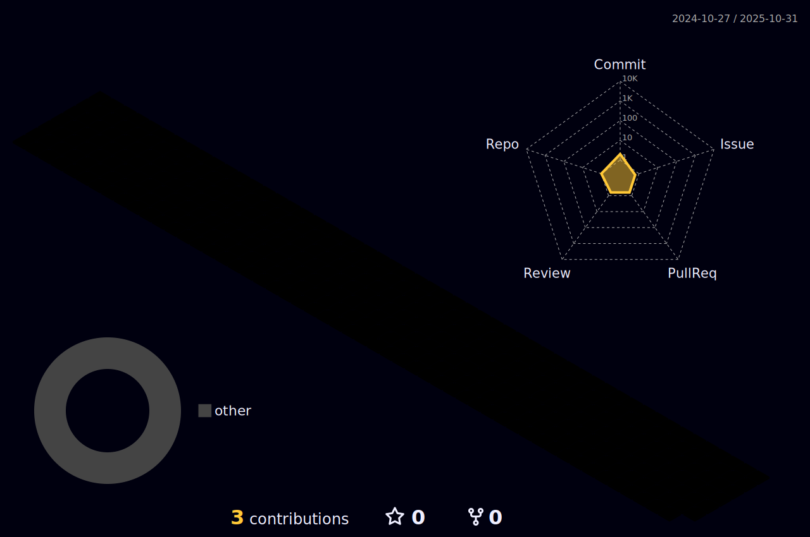

<!--

### Hi there 👋

**Draf09/Draf09** is a ✨ _special_ ✨ repository because its `README.md` (this file) appears on your GitHub profile.

Here are some ideas to get you started:

- 🔭 I’m currently working on ...
- 🌱 I’m currently learning ...
- 👯 I’m looking to collaborate on ...
- 🤔 I’m looking for help with ...
- 💬 Ask me about ...
- 📫 How to reach me: ...
- 😄 Pronouns: ...
- ⚡ Fun fact: ...
-->

<h1 align="center">Hi , I'm Rafael Dias</h1>
<h3 align="center">A software engineer and computer science student</h3>

## GitHub Stats

  

  

  

  

  

# Contributions

<h3 align="left">Connect with me:</h3>

<h3 align="left">Languages and Tools:</h3>

  

  
  

  

    

  

  

  

  

  

  

  

  

  

  

  

  

  

  

  

  

<h3 align="left">Support Me:</h3>

  

  

  

   

- 📫 How to reach me **fontanadias@gmail.com**